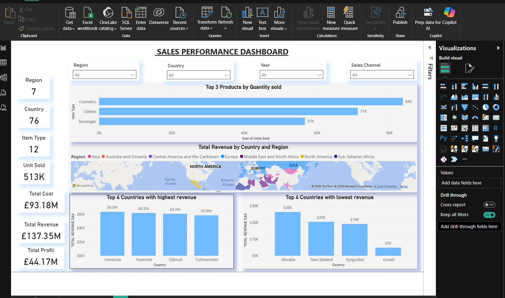

# Sales Performance Dashboard 

An interactive Power BI dashboard analysing global sales performance 
across 7 regions, 76 countries, and 12 product types, enabling 
data-driven decisions on revenue, cost, and profitability.

---

## Problem Statement
Businesses operating across multiple regions and sales channels often 
lack a single, clear view of where revenue is being generated and where 
performance is lagging. This dashboard consolidates global sales data 
into one interactive report, allowing stakeholders to identify top 
performers, underperforming markets, and profitability gaps at a glance.

---

## Tools Used
- **Power BI** – Dashboard design, DAX measures, interactive slicers,
  map visualisation
- **Excel / SQL** – Data cleaning and preparation

---

## Dashboard Features
- **KPI Cards** – Region (7), Country (76), Item Type (12),
  Units Sold (513K), Total Cost (£93.18M), Total Revenue (£137.35M),
  Total Profit (£44.17M)
- **Top 3 Products by Quantity Sold** – Cosmetics (84K), Clothes (71K),
  Beverages (57K)
- **Revenue Map** – Total Revenue by Country and Region across 8 global
  regions
- **Top 4 Countries by Highest Revenue** – Honduras (£6.3M),
  Myanmar (£6.2M), Djibouti (£6.1M), Turkmenistan (£5.8M)
- **Top 4 Countries by Lowest Revenue** – Slovakia (£30K),
  New Zealand (£26K), Kyrgyzstan (£20K), Kuwait (£5K)
- **Interactive Filters** – Sliceable by Region, Country, Year,
  and Sales Channel

---

## Key Findings
- **Total profit margin of 32%** (£44.17M profit on £137.35M revenue)
- **Cosmetics is the highest volume product** with 84K units sold,
  suggesting strong consumer demand
- **Significant revenue disparity between markets** — top country
  (Honduras £6.3M) generates 1,260x more revenue than the lowest
  (Kuwait £5K)
- **513K total units sold** across all regions and channels,
  indicating high operational scale
- The geographic map reveals **revenue concentration in specific
  regions**, highlighting untapped market opportunities

---

## Recommendations
- Prioritise investment in high-performing product categories
  (Cosmetics, Clothes) to maximise volume and revenue
- Investigate low-revenue markets (Kuwait, Kyrgyzstan) to determine
  whether to improve penetration or reallocate resources
- Analyse sales channel performance to identify which channels
  drive the highest profit margins

---

## Dashboard Preview

---

## Author
**Akinlolu Oyetakin** – Data Analyst
[LinkedIn](https://www.linkedin.com/in/akinlolu-oyetakin-50a495245) |
